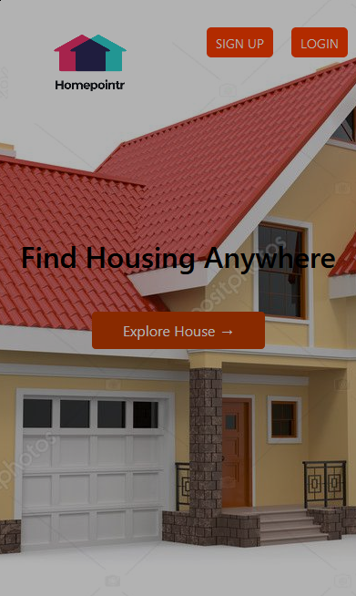

# Homepointr-frontend

A frontend web app that allow user to browse houses and add them to his favourites list, build with React and Redux and connected to a backend API build using Rails. 

<div align="center">

[](https://github.com/Dipeshtwis/find-your-house-frontend/)
[](https://github.com/Dipeshtwis/find-your-house-frontend/issues)
[](https://github.com/Dipeshtwis/find-your-house-frontend/pulls)

</div>

## 📝 Contents

<p align="center">
<a href="#with">Built with</a>&nbsp;&nbsp;&nbsp;|&nbsp;&nbsp;&nbsp;
<a href="#sc">Screenshot</a>&nbsp;&nbsp;&nbsp;|&nbsp;&nbsp;&nbsp;
<a href="#ll">Live Demo Link</a>&nbsp;&nbsp;&nbsp;|&nbsp;&nbsp;&nbsp;
<a href="#gs">Getting started</a>&nbsp;&nbsp;&nbsp;|&nbsp;&nbsp;&nbsp;
<a href="#author">Author</a>
</p>

## 🔧 Built with<a name = "with"></a>

- React Js
- Redux
- Rails API
- axios
- jest


## Rails Back-End Project

[Rails Code](https://github.com/Dipeshtwis/find-your-house/tree/feature/house)

## Project Screenshot <a name = "sc"></a>

## Will update Soon

<!-- ## Home Page



## House page


## House-Detail Page


## Favourite Page

 -->


## Live Demo Link <a name = "ll"></a>

[Link Demo](https://homepointrdeep.herokuapp.com/)


## Getting Started <a name = "gs"></a>

To get a local copy of the repository please run the following commands on your terminal:

```
$ cd <folder>
```

~~~bash
$ git clone https://github.com/Dipeshtwis/find-your-house-frontend.git
$ cd find-your-house-frontend


~~~

To run on the local server

~~~bash
$ npm start
~~~

Runs the app in the development mode.\
Open [http://localhost:3000](http://localhost:3000) to view it in the browser.

The page will reload if you make edits.\
You will also see any lint errors in the console.

## To Test the project

~~~bash

$ npm test

~~~


## ✒️  Authors <a name = "author"></a>


👤 **Dipesh Kumar**

- Github: [@Dipeshtwis](https://github.com/Dipeshtwis)
- Twitter: [@97deepeshkumar](https://twitter.com/97deepeshkumar)
- Linkedin: [dipeshtwis](https://www.linkedin.com/in/dipeshtwis/)


## 🤝 Contributing

Contributions, issues and feature requests are welcome!

Feel free to check the [issues page](https://github.com/Dipeshtwis/find-your-house-frontend/issues).


## 👍 Show your support

Give a ⭐️ if you like this project!

## :clap: Acknowledgements

- Microverse: [@microverse](https://www.microverse.org/)

## 📝 License

This project is [MIT](./LICENSE) licensed.

